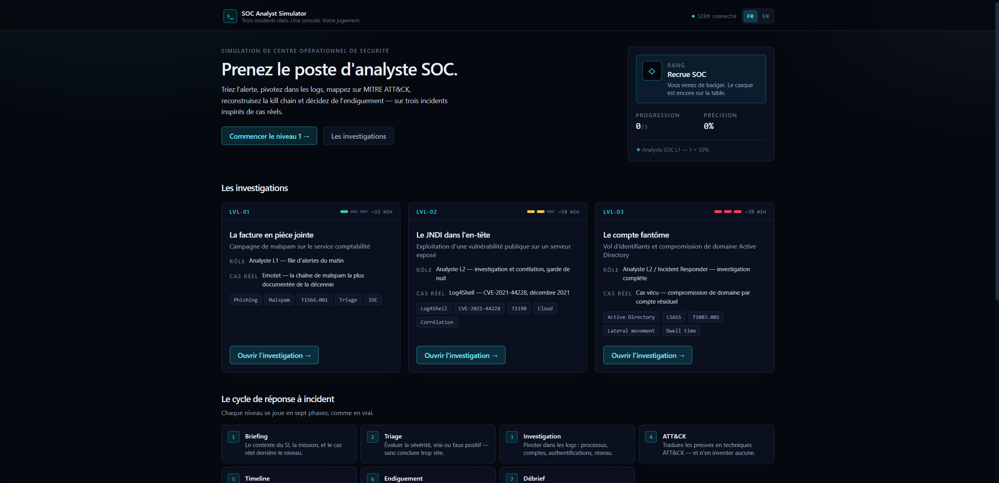
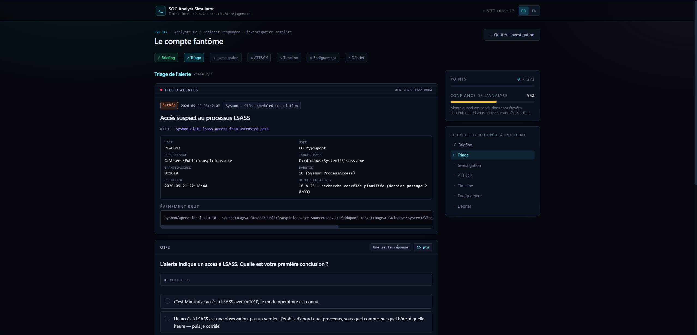
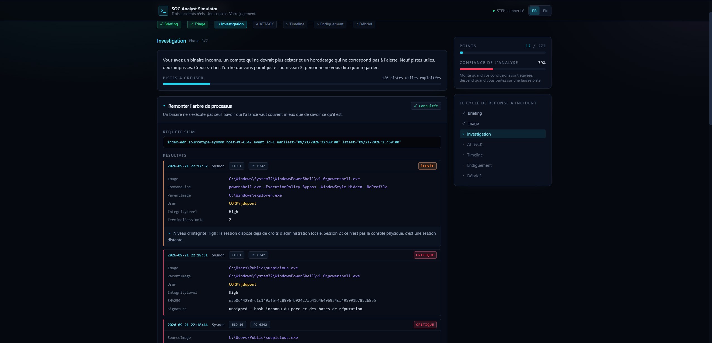
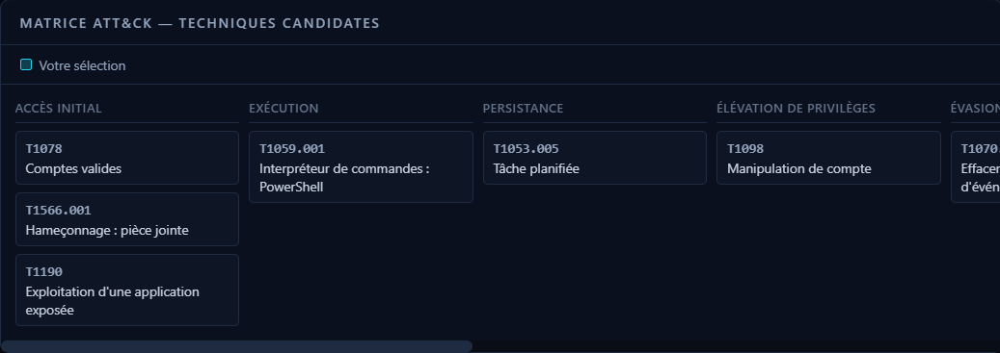
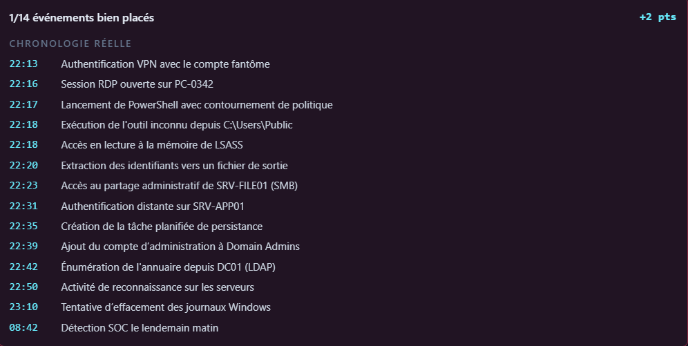

<div align="center">

# SOC Analyst Simulator

**Trois incidents réels. Une console. Votre jugement.**
*Three real incidents. One console. Your judgement.*

[](https://react.dev)
[](https://www.typescriptlang.org)
[](https://vitejs.dev)
[](https://tailwindcss.com)
[](LICENSE)

### ▶ [Démo en ligne / Live demo](https://Pinguz0x0.github.io/soc-analyst-simulator/)

[Français](#-français) · [English](#-english)

</div>



---

## 🇫🇷 Français

### Le pitch

Un jeu web qui met le joueur dans le fauteuil d'un analyste SOC et lui fait vivre
un cycle complet de réponse à incident — **triage, investigation, mapping MITRE
ATT&CK, reconstruction de la kill chain, endiguement, débrief** — sur trois
incidents inspirés de cas réels, du plus simple au plus difficile.

Le pari : rester accessible à quelqu'un qui découvre le métier, **et** rester
juste pour un analyste expérimenté. Chaque réponse, bonne ou mauvaise, est
expliquée par le raisonnement SOC qui la sous-tend — pas par un « correct / faux ».

100 % statique, bilingue FR/EN, aucun backend, aucune télémétrie.

### Ce que ce projet démontre

| Domaine | Mise en œuvre concrète dans le jeu |
| --- | --- |
| **Triage d'alertes** | Sévérité ≠ verdict, qualification avant conclusion, critères d'escalade objectifs |
| **Analyse de logs Windows / Sysmon** | Sysmon EID 1/3/10/11/13, Security 4624/4625/4648/4672/4688/4698/4722/4725/4728/1102, masques d'accès LSASS |
| **Corrélation SIEM** | Croisement message trace, EDR, proxy, VPN, AD, journaux cloud ; requêtes de recherche réalistes |
| **MITRE ATT&CK** | 22 techniques mappées sur 10 tactiques, avec preuve exigée — et des techniques leurres à ne PAS cocher |
| **Réponse à incident** | Isolation vs extinction, ordre de collecte, rotation de comptes de service, double rotation de `krbtgt` |
| **Forensic** | Volatilité des preuves, Prefetch / Amcache / Shimcache, fenêtre d'analyse et biais de la fenêtre standard |
| **Detection engineering** | Causes racines, règles corrélées proposées, latence de détection, contournement de signature WAF |
| **Front-end** | React 18 + TypeScript strict, moteur data-driven, i18n maison, accessibilité, déploiement CI |

### Les trois niveaux

| # | Niveau | Rôle | Cas réel | Ce qu'on y apprend |
| --- | --- | --- | --- | --- |
| **1** | **La facture en pièce jointe** | Analyste L1, file d'alertes | Emotet (chaîne de malspam) | Lire une alerte, distinguer vrai et faux positif, extraire des IOC, mesurer le périmètre |
| **2** | **Le JNDI dans l'en-tête** | Analyste L2, garde de nuit | Log4Shell — CVE-2021-44228 | Corréler quatre sources, distinguer contournement et correction, ne pas oublier les secrets cloud |
| **3** | **Le compte fantôme** | L2 / Incident Responder | Compromission de domaine par compte résiduel | Ne pas conclure « Mimikatz » trop vite, remonter 41 jours de présence, endiguer sans casser la production |

Chaque niveau se joue en sept phases : **Briefing → Triage → Investigation →
ATT&CK → Timeline → Endiguement → Débrief.**

### Le piège pédagogique de chaque niveau

- **Niveau 1** — « L'antivirus a mis en quarantaine, donc c'est réglé. » Non : la
  quarantaine est arrivée trois minutes après l'exécution, la clé Run et la
  seconde copie du binaire sont toujours là.
- **Niveau 2** — « J'ajoute une règle WAF sur `${jndi:` et c'est corrigé. » Non :
  c'est exactement la règle qui a été contournée par obfuscation, et elle ne
  révoque pas les identifiants cloud déjà volés.
- **Niveau 3** — « Accès LSASS, donc Mimikatz. » Non : un accès LSASS est une
  observation. Quel processus, sous quel compte, sur quel hôte, à quelle heure —
  *puis* on corrèle. C'est ce refus du raccourci qui fait découvrir que l'attaque
  avait commencé six semaines plus tôt.

### Gamification

- **Points** par bonne réponse, par piste d'investigation utile et par
  chronologie correctement reconstituée (crédit partiel sur les questions à
  réponses multiples, une mauvaise case annule une bonne).
- **Jauge de confiance** de l'analyse : elle monte quand vos conclusions sont
  étayées, elle descend quand vous partez sur une fausse piste.
- **Rangs** : Recrue SOC → Analyste L1 → Analyste L2 → Incident Responder.
- **15 badges** qui récompensent un raisonnement, pas un clic : *Ne conclut pas à
  Mimikatz trop vite*, *A préservé les preuves volatiles*, *A repéré le compte
  fantôme*, *Ne casse pas la production*, *Le SIEM a la mémoire longue*…
- **Récap partageable** en fin de partie, note de S à D, détail par phase.

### Architecture

Le moteur est **piloté par la donnée** : un même composant joue n'importe quel
scénario décrit par une structure typée. Ajouter un quatrième niveau, c'est
ajouter un fichier de données — aucun composant à toucher.

```
src/
├── types/scenario.ts          # Le contrat de données (Scenario, Phase, Question, Pivot…)
├── data/
│   ├── level1-malspam.ts      # Niveau 1 — contenu bilingue complet
│   ├── level2-log4shell.ts    # Niveau 2
│   ├── level3-ghost-account.ts# Niveau 3
│   ├── badges.ts              # Définitions des badges
│   └── scenarios.ts           # Index + libellés des tactiques ATT&CK
├── engine/
│   ├── engine.ts              # Réducteur pur : scoring, confiance, badges, progression
│   ├── scoring.ts             # Notes (S→D) et rangs
│   ├── storage.ts             # localStorage défensif (dégradation propre)
│   └── shuffle.ts             # Mélange déterministe (timeline stable entre rendus)
├── i18n/
│   ├── strings.ts             # Dictionnaire UI FR/EN
│   └── I18nProvider.tsx       # Contexte, bascule persistée, interpolation
├── components/                # AlertCard, LogViewer, MitreMatrix, TimelineBuilder…
└── screens/                   # HomeScreen, ScenarioScreen, SummaryScreen

scripts/
└── validate-content.mjs       # Tests de contenu exécutés avant chaque build
```

Le cœur du contrat :

```ts
type Phase =
  | { kind: 'briefing';      content: I18n; objectives: I18n[] }
  | { kind: 'alert';         alert: AlertCard; questions: Question[] }
  | { kind: 'investigation'; pivots: Pivot[]; minPivots: number; question?: Question }
  | { kind: 'mitre';         techniques: MitreTechnique[]; question: Question }
  | { kind: 'timeline';      events: TimelineEvent[]; points: number }
  | { kind: 'decision';      questions: Question[] }
  | { kind: 'debrief';       lessons: I18n[]; rootCause: I18n[]; report: I18n };
```

Quelques choix de conception :

- **Tout texte visible est un objet `{ fr, en }`** typé. Il est impossible
  d'ajouter du contenu dans une seule langue sans que TypeScript le signale.
- **Le scoring vit dans un réducteur pur** : aucun composant ne calcule de points.
  Les fonctions `gradeAnswer`, `gradeTimeline` et `maxPointsFor` sont testables
  isolément.
- **`localStorage` est un bonus, jamais une dépendance** : chaque accès est
  protégé, et le jeu fonctionne en navigation privée (avec un avertissement).
- **Les mauvaises réponses coûtent de la confiance, pas seulement des points** —
  parce qu'en vrai, une fausse piste coûte du temps, pas une note.
- **Le contenu est testé, pas seulement typé.** `npm run validate` vérifie les
  623 chaînes bilingues, les identifiants d'options orphelins, les doublons, la
  cohérence entre techniques « observées » et réponses attendues, et le fait que
  chaque lien ATT&CK pointe bien vers la technique qu'il annonce. Le script tourne
  avant chaque build, en local comme en CI.

### Rigueur du contenu

- Les **techniques ATT&CK** pointent vers les fiches officielles
  `attack.mitre.org`. Chaque technique « observée » est accompagnée de la preuve
  qui la justifie (identifiant d'événement + horodatage).
- Les **sources** des niveaux 1 et 2 sont des références canoniques (CISA, NVD,
  Apache, MITRE). Les URL dont l'exactitude n'a pas pu être vérifiée hors ligne
  portent un commentaire `// TODO: vérifier l'URL exacte` dans le code, à côté du
  lien — aucune URL n'a été inventée.
- Les **adresses IP externes** utilisent les plages de documentation RFC 5737
  (`203.0.113.0/24`). Rien ne pointe vers une infrastructure réelle.
- Les **noms d'hôtes, comptes et organisations** sont fictifs ; les journaux,
  identifiants d'événements Windows et raisonnements sont réalistes.

### Accessibilité et i18n

- Bascule FR/EN dans l'en-tête, mémorisée dans `localStorage`, première visite
  alignée sur la langue du navigateur, attribut `lang` du document mis à jour.
- Questions construites avec de vrais `<input type="radio">` / `<checkbox>` dans
  un `<fieldset>` : navigation clavier et lecteurs d'écran natifs.
- La reconstruction de la timeline propose **deux chemins équivalents** :
  glisser-déposer, ou boutons ↑ / ↓ étiquetés (clavier et mobile).
- Anneau de focus visible et homogène, contrastes vérifiés sur fond sombre,
  `role="status"` sur les retours d'analyse, `prefers-reduced-motion` respecté.

### Captures d'écran

| | |
| --- | --- |
|  |  |
| **Triage** — carte d'alerte et première décision | **Investigation** — pivots, logs et IOC |
|  |  |
| **ATT&CK** — mini-matrice après validation | **Timeline** — reconstruction de la kill chain |

> Les emplacements attendus sont décrits dans [`docs/screenshots/`](docs/screenshots/).

### Installation

```bash
git clone https://github.com/Pinguz0x0/soc-analyst-simulator.git
cd soc-analyst-simulator
npm install
npm run dev
```

| Commande | Effet |
| --- | --- |
| `npm run dev` | Serveur de développement Vite sur `http://localhost:5173` |
| `npm run typecheck` | Vérification TypeScript stricte, sans émission |
| `npm run validate` | Tests de contenu : identifiants orphelins, doublons, liens ATT&CK, chaînes FR/EN manquantes |
| `npm run build` | Typecheck, validation du contenu, puis build de production dans `dist/` |
| `npm run preview` | Sert le build de production localement |

Prérequis : **Node.js 20 ou plus** et npm.

### Déploiement sur GitHub Pages

Le dépôt contient un workflow [`.github/workflows/deploy.yml`](.github/workflows/deploy.yml)
qui construit et publie le site à chaque `push` sur `main`.

1. Poussez le dépôt sur GitHub.
2. **Settings → Pages → Source : GitHub Actions**.
3. Poussez sur `main` : le site est publié sur
   `https://<utilisateur>.github.io/<dépôt>/`.

Le chemin de base est injecté automatiquement par le workflow
(`BASE_PATH=/<nom-du-dépôt>/`), il n'y a rien à modifier dans
`vite.config.ts` — même si vous renommez le dépôt.

### Licence

[MIT](LICENSE). Le contenu pédagogique est librement réutilisable ; MITRE ATT&CK®
est une marque déposée de The MITRE Corporation.

---

## 🇬🇧 English

### The pitch

A browser game that puts the player in a SOC analyst's seat and walks them
through a full incident response cycle — **triage, investigation, MITRE ATT&CK
mapping, kill chain reconstruction, containment, debrief** — across three
incidents drawn from real cases, from the simplest to the hardest.

The bet: stay approachable for someone discovering the job, **and** stay correct
for an experienced analyst. Every answer, right or wrong, is explained through
the SOC reasoning behind it — not with a bare "correct / incorrect".

100% static, bilingual FR/EN, no backend, no telemetry.

### What this project demonstrates

| Area | How it shows up in the game |
| --- | --- |
| **Alert triage** | Severity ≠ verdict, qualify before concluding, objective escalation criteria |
| **Windows / Sysmon log analysis** | Sysmon EID 1/3/10/11/13, Security 4624/4625/4648/4672/4688/4698/4722/4725/4728/1102, LSASS access masks |
| **SIEM correlation** | Message trace, EDR, proxy, VPN, AD and cloud audit logs cross-referenced; realistic search queries |
| **MITRE ATT&CK** | 22 techniques across 10 tactics, evidence required — plus decoy techniques you must *not* tick |
| **Incident response** | Isolation vs power-off, collection order, service account rotation, double `krbtgt` rotation |
| **Forensics** | Evidence volatility, Prefetch / Amcache / Shimcache, analysis window and the bias of the standard window |
| **Detection engineering** | Root causes, proposed correlated rules, detection latency, WAF signature bypass |
| **Front-end** | React 18 + strict TypeScript, data-driven engine, hand-rolled i18n, accessibility, CI deployment |

### The three levels

| # | Level | Seat | Real case | What you learn |
| --- | --- | --- | --- | --- |
| **1** | **The invoice attachment** | Tier 1, alert queue | Emotet (malspam chain) | Read an alert, tell true from false positive, extract IOCs, measure scope |
| **2** | **The JNDI in the header** | Tier 2, night shift | Log4Shell — CVE-2021-44228 | Correlate four sources, tell mitigation from remediation, remember the cloud secrets |
| **3** | **The ghost account** | Tier 2 / Incident Responder | Domain compromise via a residual account | Don't jump to "Mimikatz", uncover 41 days of dwell time, contain without breaking production |

Every level runs through seven phases: **Briefing → Triage → Investigation →
ATT&CK → Timeline → Containment → Debrief.**

### Each level's teaching trap

- **Level 1** — "The AV quarantined it, so it's handled." No: the quarantine
  landed three minutes after execution, and the Run key plus a second copy of
  the binary are still on disk.
- **Level 2** — "I'll add a WAF rule on `${jndi:` and we're fixed." No: that is
  exactly the rule that was bypassed through obfuscation, and it revokes none of
  the already-stolen cloud credentials.
- **Level 3** — "LSASS access, so Mimikatz." No: an LSASS access is an
  observation. Which process, under which account, on which host, at what time —
  *then* correlate. Refusing that shortcut is what uncovers an intrusion that
  started six weeks earlier.

### Gamification

- **Points** for correct answers, useful investigation pivots and a correctly
  rebuilt timeline (partial credit on multi-answer questions; a wrong tick
  cancels a right one).
- **Analysis confidence gauge**: it rises when your conclusions are evidenced and
  falls when you chase a dead end.
- **Ranks**: SOC Trainee → Tier 1 Analyst → Tier 2 Analyst → Incident Responder.
- **15 badges** that reward reasoning rather than clicking: *Does not jump to
  Mimikatz*, *Preserved volatile evidence*, *Spotted the ghost account*, *Does
  not break production*, *The SIEM has a long memory*…
- **Shareable recap** at the end, grade from S to D, per-phase breakdown.

### Architecture

The engine is **data-driven**: one component set plays any scenario described by
a typed structure. Adding a fourth level means adding a data file — no component
changes.

See the tree in the French section above; file names are language-neutral.

Design choices worth calling out:

- **Every player-visible string is a typed `{ fr, en }` object.** Adding content
  in a single language is a TypeScript error, not a runtime surprise.
- **Scoring lives in a pure reducer**: no component computes points.
  `gradeAnswer`, `gradeTimeline` and `maxPointsFor` are independently testable.
- **`localStorage` is a bonus, never a dependency**: every access is guarded, and
  the game runs in private windows (with a visible warning).
- **Wrong answers cost confidence, not just points** — because in real life a
  dead end costs time, not marks.
- **The content is tested, not just typed.** `npm run validate` checks the 623
  bilingual strings, dangling option ids, duplicates, the agreement between
  "observed" techniques and expected answers, and that every ATT&CK link points
  at the technique it claims. It runs before every build, locally and in CI.

### Content rigour

- **ATT&CK techniques** link to the official `attack.mitre.org` pages, and every
  "observed" technique carries the evidence that justifies it (event ID +
  timestamp).
- **Sources** for levels 1 and 2 are canonical references (CISA, NVD, Apache,
  MITRE). URLs that could not be verified offline carry a
  `// TODO: vérifier l'URL exacte` comment next to the link in the code — no URL
  was invented.
- **External IP addresses** use the RFC 5737 documentation ranges
  (`203.0.113.0/24`). Nothing points at real infrastructure.
- **Hostnames, accounts and organisations** are fictional; the logs, Windows
  event IDs and reasoning are realistic.

### Accessibility and i18n

- FR/EN switch in the header, stored in `localStorage`, first visit follows the
  browser language, the document `lang` attribute is kept in sync.
- Questions are built from real `<input type="radio">` / `<checkbox>` elements
  inside a `<fieldset>`: native keyboard and screen reader behaviour.
- Timeline reconstruction offers **two equivalent paths**: drag and drop, or
  labelled ↑ / ↓ buttons (keyboard and touch).
- Consistent visible focus ring, contrast checked against the dark surface,
  `role="status"` on analysis feedback, `prefers-reduced-motion` honoured.

### Getting started

```bash
git clone https://github.com/Pinguz0x0/soc-analyst-simulator.git
cd soc-analyst-simulator
npm install
npm run dev
```

| Command | What it does |
| --- | --- |
| `npm run dev` | Vite dev server on `http://localhost:5173` |
| `npm run typecheck` | Strict TypeScript check, no emit |
| `npm run validate` | Content tests: dangling ids, duplicates, ATT&CK links, missing FR/EN strings |
| `npm run build` | Typecheck, content validation, then a production build into `dist/` |
| `npm run preview` | Serves the production build locally |

Requires **Node.js 20+** and npm.

### Deploying to GitHub Pages

The repository ships a workflow
([`.github/workflows/deploy.yml`](.github/workflows/deploy.yml)) that builds and
publishes on every push to `main`.

1. Push the repository to GitHub.
2. **Settings → Pages → Source: GitHub Actions**.
3. Push to `main`: the site goes live at
   `https://<user>.github.io/<repo>/`.

The base path is injected by the workflow (`BASE_PATH=/<repo-name>/`), so there
is nothing to edit in `vite.config.ts` — even if you rename the repository.

### License

[MIT](LICENSE). The educational content is free to reuse; MITRE ATT&CK® is a
registered trademark of The MITRE Corporation.
